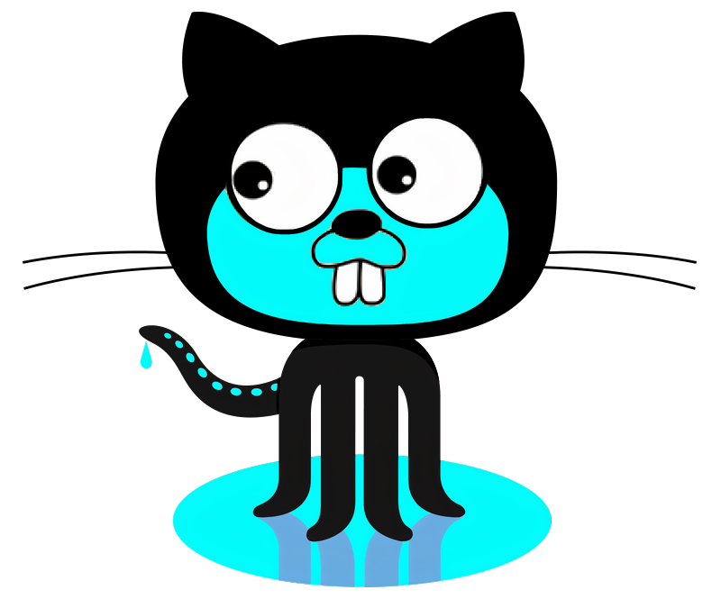

# octostats 🐙🐱📦

[](https://pkg.go.dev/github.com/irevenko/octostats)

> A supplementary Go package on top of <a href="https://github.com/google/go-github">go-github</a> and <a href="https://github.com/shurcooL/githubv4">githubv4</a>

<p align="center"></p>

<p align="center">GitHub API Superstructure</p> <br>

# Installation 🔨
```go get github.com/google/go-github``` <br>
```go get github.com/google/go-querystring``` <br>
```go get github.com/shurcooL/githubv4``` <br>
```go get golang.org/x/oauth2``` <br> <br>

```go get github.com/irevenko/octostats```

# Methods 🧰
* [REST](#REST "Goto #REST")
	* [AllRepos](#AllRepos "Goto ##AllRepos")
	* [LanguagesByRepo](#LanguagesByRepo "Goto ##LanguagesByRepo")
	* [MostUsedLicenses](#MostUsedLicenses "Goto ##MostUsedLicenses")
	* [MostStarredRepos](#MostStarredRepos "Goto ##MostStarredRepos")
	* [MostForkedRepos](#MostForkedRepos "Goto ##MostForkedRepos")
	* [StarsPerLanguage](#StarsPerLanguage "Goto ##StarsPerLanguage")
	* [ForksPerLanguage](#AllRepos "Goto ##ForksPerLanguage")
	* [TotalStars](#TotalStars "Goto ##TotalStars")
	* [TotalForks](#TotalForks "Goto ##TotalForks")
* [GraphQL](#GraphQL "Goto #GraphQL")
	* [LanguagesByCommit](#LanguagesByCommit "Goto ##LanguagesByCommit")
	* [AllContributions](#AllContributions "Goto ##AllContributions")
	* [AllCommits](#AllCommits "Goto ##AllCommits")
	* [AllIssues](#AllIssues "Goto ##AllIssues")
	* [AllPullRequests](#AllPullRequests "Goto ##AllPullRequests")


# Docs 📋
Go Reference: https://pkg.go.dev/github.com/irevenko/octostats
# REST
All examples are using ```AuthREST``` <br>
```ctx, client := r.AuthREST("<YOUR_TOKEN>")```

If you want you can write your own auth but keep in mind that you in order to use this package ```client, context``` are required


## AllRepos
Returns slice of repos for user/organization (https://api.github.com/users/USERNAME/repos)
```go
import ( 
    "fmt"

	"github.com/google/go-github/github"
    r "github.com/irevenko/octostats/rest"
)

func main() {
	ctx, client := r.AuthREST("<YOUR_TOKEN>")

	allRepos := r.AllRepos(ctx, client, "<USER_OR_ORGANIZATION>")
	fmt.Println(allRepos)
}
```

## LanguagesByRepo
Returns two slices of names and occurrences
```go
import ( 
	"fmt"
	"strconv"

	"github.com/google/go-github/github"
    r "github.com/irevenko/octostats/rest"
)

func main() {
	ctx, client := r.AuthREST("<YOUR_TOKEN>")

	allRepos := r.AllRepos(ctx, client, "<USER_OR_ORGANIZATION>")

	usedLangs, langsNum := r.LanguagesByRepo(client, allRepos)
	fmt.Println("Languages By Repo")
	for i, v := range usedLangs {
		fmt.Println(v + ": " + strconv.Itoa(langsNum[i]))
	}
}
```

## MostUsedLicenses
Returns two slices of names and occurrences
``` go
import ( 
	"fmt"
	"strconv"

	"github.com/google/go-github/github"
	r "github.com/irevenko/octostats/rest"
)

func main() {
	ctx, client := r.AuthREST("<YOUR_TOKEN>")

	allRepos := r.AllRepos(ctx, client, "<USER_OR_ORGANIZATION>")

	usedLicenses, licsNum := r.MostUsedLicenses(client, allRepos)
	fmt.Println("Most used licenses")
	for i, v := range usedLicenses {
		fmt.Println(v + ": " + strconv.Itoa(licsNum[i]))
	}
}
```

## MostStarredRepos
Returns two slices of names and stars num
``` go
import ( 
	"fmt"
	"strconv"

	"github.com/google/go-github/github"
	r "github.com/irevenko/octostats/rest"
)

func main() {
	ctx, client := r.AuthREST("<YOUR_TOKEN>")

	allRepos := r.AllRepos(ctx, client, "<USER_OR_ORGANIZATION>")
    
	starredRepos, starredNums := r.MostStarredRepos(client, allRepos)
	fmt.Println("Most starred repos")
	for i, v := range starredRepos {
		fmt.Println(v + ": " + strconv.Itoa(starredNums[i]))
	}
}
```

## MostForkedRepos
Returns two slices of names and forks num
```go
import ( 
	"fmt"
	"strconv"

	"github.com/google/go-github/github"
	r "github.com/irevenko/octostats/rest"
)

func main() {
	ctx, client := r.AuthREST("<YOUR_TOKEN>")

	allRepos := r.AllRepos(ctx, client, "<USER_OR_ORGANIZATION>")
    
	forkedRepos, forkedNums := r.MostForkedRepos(client, allRepos)
	fmt.Println("Most forked repos")
	for i, v := range forkedRepos {
		fmt.Println(v + ": " + strconv.Itoa(forkedNums[i]))
	}
}
```

## StarsPerLanguage
Returns two slices of languages and stars num
```go
import ( 
	"fmt"
	"strconv"

	"github.com/google/go-github/github"
	r "github.com/irevenko/octostats/rest"
)

func main() {
	ctx, client := r.AuthREST("<YOUR_TOKEN>")

	allRepos := r.AllRepos(ctx, client, "<USER_OR_ORGANIZATION>")
    
	starsPerL, starsNum := r.StarsPerLanguage(client, allRepos)
	fmt.Println("Stars per lang")
	for i, v := range starsPerL {
		fmt.Println(v + ": " + strconv.Itoa(starsNum[i]))
	}
}
```
## ForksPerLanguage
Returns two slices of languages and forks num
```go
import ( 
 	"fmt"
	"strconv"

	"github.com/google/go-github/github"
	r "github.com/irevenko/octostats/rest"
)

func main() {
	ctx, client := r.AuthREST("<YOUR_TOKEN>")

	allRepos := r.AllRepos(ctx, client, "<USER_OR_ORGANIZATION>")

	forksPerL, forksNum := r.ForksPerLanguage(client, allRepos)
	fmt.Println("Forks per lang")
	for i, v := range forksPerL {
		fmt.Println(v + ": " + strconv.Itoa(forksNum[i]))
	}
}
```

## TotalStars
Returns integer number
```go
import ( 
	"fmt"

	"github.com/google/go-github/github"
	r "github.com/irevenko/octostats/rest"
)

func main() {
	ctx, client := r.AuthREST("<YOUR_TOKEN>")

	allRepos := r.AllRepos(ctx, client, "<USER_OR_ORGANIZATION>")
    
	totalStars := r.TotalStars(client, allRepos)
	fmt.Println("Total stars")
	fmt.Println(totalStars)
}
```

## TotalForks
Returns integer number
```go
import ( 
	"fmt"

	"github.com/google/go-github/github"
	r "github.com/irevenko/octostats/rest"
)

func main() {
	ctx, client := r.AuthREST("<YOUR_TOKEN>")

	allRepos := r.AllRepos(ctx, client, "<USER_OR_ORGANIZATION>")
    
	totalForks := r.TotalForks(client, allRepos)
	fmt.Println("Total forks")
	fmt.Println(totalForks)
}
```

# GraphQL
All examples are using ```AuthGraphQL``` <br>
```client := g.AuthGraphQL("<YOUR_TOKEN>")```

If you want you can write your own auth but keep in mind that you in order to use this package ```client``` is required

## LanguagesByCommit
Returns two slices of languages and commits <br>
```from``` and ```to``` must be within 1 year span (2009, 2010 OR 2014, 2015 etc...)
```go
import ( 
	"fmt"

	"github.com/shurcooL/githubv4"
	g "github.com/irevenko/octostats/graphql"
)

func main() {
	qlClient := g.AuthGraphQL("<YOUR_TOKEN>")

	langs, commits := g.LanguagesByCommit(qlClient, "<USER_OR_ORGANIZATION>", 2020, 2021)
	fmt.Println("\nLanguages by commit")
	for i, v := range langs {
		fmt.Printf("%v : %v\n", v, commits[i])
	}
}
```

## AllContributions
Returns ```ContributionsCollection``` (see https://github.com/irevenko/octostats/blob/main/graphql/types.go) <br>
```from``` and ```to``` must be within 1 year span (2009, 2010 OR 2014, 2015 etc...)
```go
import ( 
	"fmt"

	"github.com/shurcooL/githubv4"
	g "github.com/irevenko/octostats/graphql"
)

func main() {
	qlClient := g.AuthGraphQL("<YOUR_TOKEN>")

	allContribs := g.AllContributions(qlClient, "<USER_OR_ORGANIZATION>", 2020, 2021)
	fmt.Println("\nAll contribs 2020-2021:")
	fmt.Println(allContribs)
}
```

## AllCommits
Returns ```[]commitContributions``` (see https://github.com/irevenko/octostats/blob/main/graphql/types.go)<br>
```from``` and ```to``` must be within 1 year span (2009, 2010 OR 2014, 2015 etc...)
```go
import ( 
	"fmt"

	"github.com/shurcooL/githubv4"
	g "github.com/irevenko/octostats/graphql"
)

func main() {
	qlClient := g.AuthGraphQL("<YOUR_TOKEN>")

	allCommits := g.AllCommits(qlClient, "<USER_OR_ORGANIZATION>", 2020, 2021)
	fmt.Println("\nAll commits 2020-2021:")
	fmt.Println(allCommits)
}
```

## AllIssues
Returns ```[]issueContributions``` (see https://github.com/irevenko/octostats/blob/main/graphql/types.go)<br>
```from``` and ```to``` must be within 1 year span (2009, 2010 OR 2014, 2015 etc...)
```go
import ( 
	"fmt"

	"github.com/shurcooL/githubv4"
	g "github.com/irevenko/octostats/graphql"
)

func main() {
	qlClient := g.AuthGraphQL("<YOUR_TOKEN>")

	allIssues := g.AllIssues(qlClient, "<USER_OR_ORGANIZATION>", 2020, 2021)
	fmt.Println("\nAll issues 2020-2021:")
	fmt.Println(allIssues)
}
```

## AllPullRequests
Returns ```[]pullRequestContributions``` (see https://github.com/irevenko/octostats/blob/main/graphql/types.go)<br>
```from``` and ```to``` must be within 1 year span (2009, 2010 OR 2014, 2015 etc...)
```go
import ( 
	"fmt"

	"github.com/shurcooL/githubv4"
	g "github.com/irevenko/octostats/graphql"
)

func main() {
	qlClient := g.AuthGraphQL("<YOUR_TOKEN>")

	allPrs := g.AllPullRequests(qlClient, "<USER_OR_ORGANIZATION>", 2020, 2021)
	fmt.Println("\nAll pull requests 2020-2021:")
	fmt.Println(allPrs)
}
```

# Contributing 🤝
Contributions, issues and feature requests are welcome! 👍 <br>
Feel free to check [open issues](https://github.com/irevenko/octostats/issues).

# What I Learned 🧠
- GraphQL basics
- GoLang API auth

# Notes
- shows private repos and repos from orgs when using empty string as name (if authorized)
- see readme-stats, metrics

# License 📑 
(c) 2021 Ilya Revenko. [MIT License](https://tldrlegal.com/license/mit-license)
